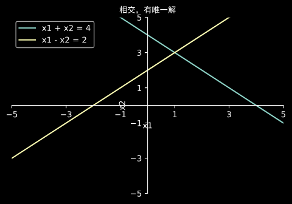
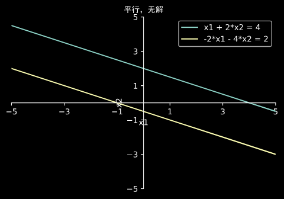
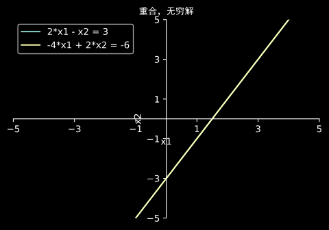

# 1. 矩阵与方程组

> `1_matrix_equations`

## 1.1 线性方程组

> `1_matrix_equations/linear-equeations.py`

- 利用回代法求解方程组

```
方程式:
 x1 - 3*x2 - 2 = 0 
 2*x2 - 6 = 0 
回代法求解:
 row2: x2 = 3 
 row1: x1 - 11 = 0 
 row1: x1 = 11 
```

$e^{i\pi} + 1 = 0$

- 通过几何关系观看是否有解







## 1.2 行阶梯形

> `1_matrix_equationsrow-echelon-form.py`

- 增广矩阵与行阶梯矩阵

```
方程式的系数矩阵
 [[ 1  2 -2]
 [ 2  5  1]
 [ 1  3  4]] 
方程式的右端常数
 [[ 1  9  9]
 [ 9  9 -2]] 
合并成增广矩阵
 [[ 1  2 -2  1  9]
 [ 2  5  1  9  9]
 [ 1  3  4  9 -2]] 
消元最后行
 [[  1   2  -2   1   9]
 [  2   5   1   9   9]
 [  0   1   6   8 -11]] 
消元第2行
 [[  1   2  -2   1   9]
 [  0   1   5   7  -9]
 [  0   1   6   8 -11]] 
消元最后行
 [[ 1  2 -2  1  9]
 [ 0  1  5  7 -9]
 [ 0  0  1  1 -2]] 
消元第2行
 [[ 1  2 -2  1  9]
 [ 0  1  0  2  1]
 [ 0  0  1  1 -2]] 
消元第1行,获得最简行阶梯矩阵
 [[ 1  0  0 -1  3]
 [ 0  1  0  2  1]
 [ 0  0  1  1 -2]] 
从最简行阶段矩阵即可获得唯一解
 方程式一解集：[-1  2  1] 
 方程式二解集：[ 3  1 -2] 
```

- 增广矩阵与行阶梯矩阵

```
方程式的系数矩阵
 [[ 1 -1  0  0]
 [ 0  1 -1  0]
 [ 0  0  1  0]
 [ 1  0  0  1]] 
方程式的右端常数
 [  50 -120  350  870] 
合并成增广矩阵
 [[   1   -1    0    0   50]
 [   0    1   -1    0 -120]
 [   0    0    1    0  350]
 [   1    0    0    1  870]] 
消元最后一行
 [[   1   -1    0    0   50]
 [   0    1   -1    0 -120]
 [   0    0    1    0  350]
 [   0    1    0    1  820]] 
消元最后一行
 [[   1   -1    0    0   50]
 [   0    1   -1    0 -120]
 [   0    0    1    0  350]
 [   0    0    1    1  940]] 
消元最后一行
 [[   1   -1    0    0   50]
 [   0    1   -1    0 -120]
 [   0    0    1    0  350]
 [   0    0    0    1  590]] 
消元第2行
 [[  1  -1   0   0  50]
 [  0   1   0   0 230]
 [  0   0   1   0 350]
 [  0   0   0   1 590]] 
消元第1行
 [[  1   0   0   0 280]
 [  0   1   0   0 230]
 [  0   0   1   0 350]
 [  0   0   0   1 590]] 
从最简行阶段矩阵即可获得唯一解
 解集：[280 230 350 590] 
[8]
```
